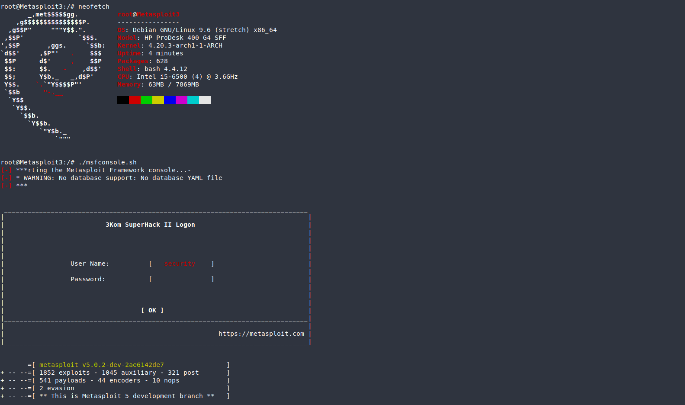

# Metasploit-v5-in-LCX-container
Metasploit Framework v.5 inside the Debian9 LXC container with nmap tool.

#### Metasploit is a Framework oriented for pentesting, this tool is inside on security distros, example: Kali Linux.
#### Contais more 1000 exploits and other scripts to break services, apps and systems, i have separately configured Metasploit 5 in a LXC container with Debian 9.

### GitHub not allowed my lxc container for exceed the size, if you want to get the container is in my gitlab.
[gitlab]: https://gitlab.com/fabiooreff/metasploit-v5-in-lcx-container/

